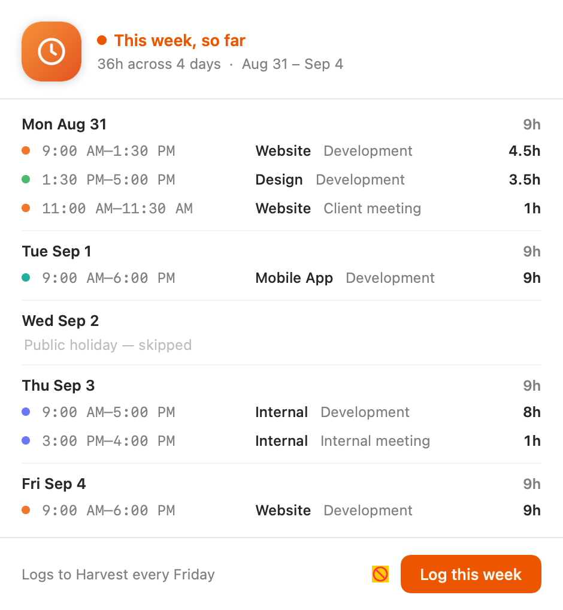

# Harvest Auto-Fill

**Your Harvest timesheet, filled from the work you already did.** A macOS menu-bar app that turns your Git commits, pushes, and calendar meetings into hours, splits them across the right projects, and files them for you every Friday.

<p align="center">
  
</p>

No more Friday-afternoon guesswork about what you worked on. Harvest Auto-Fill reads the week you had and proposes a complete, project-split timesheet you can file in one click — or schedule it to file on Friday.

[Download the latest release](https://github.com/kaelys-js/harvest-autofill/releases/latest) · [Website](https://kaelys-js.github.io/harvest-autofill/) · [Changelog](CHANGELOG.md)

[](https://github.com/kaelys-js/harvest-autofill/actions/workflows/build.yml)
[](https://github.com/kaelys-js/harvest-autofill/actions/workflows/lint.yml)


## Why you'd want it

- **It fills the week for you.** Commits, pushes, and meetings become hours, allocated across the projects they belong to, for every worked weekday. You review and file, or let the Friday reminder do it.
- **It knows your calendar.** Statutory holidays and days off are skipped, not billed. A week that crosses a month reads clearly.
- **Everything stays on your Mac.** Your Harvest, GitHub, Azure DevOps, and Google Calendar tokens live in a locked folder on your Mac. Data goes only to the services you connect, nowhere else.
- **Nothing to install alongside it.** Python is bundled inside the app. Download, open, done.
- **It keeps itself current.** The app checks for a new signed release and can install it for you, verifying an Ed25519 signature before it trusts anything.

## Get it

1. **Download** the latest `HarvestAutoFill.zip` from the [Releases page](https://github.com/kaelys-js/harvest-autofill/releases/latest).
2. **Unzip** it and move **Harvest Auto-Fill.app** to your Applications folder.
3. **First launch:** right-click the app and choose **Open** (macOS Gatekeeper asks once for a directly-downloaded app). After that, it launches normally and updates itself.

Requires macOS 26 or newer on Apple Silicon.

On first run, a short onboarding wizard connects your accounts and writes the settings into a locked folder on your Mac. Nothing is hard-coded to one person or company: you bring your own Harvest, GitHub, Azure DevOps, and Google Calendar.

## How it works

Three steps run behind the single **Log this week** button (and behind the Friday reminder):

1. **Discover** your connected accounts and projects, and build the holiday calendar. This tells the app what it may fill and when to stand down.
2. **Allocate** your week — Git commits and pushes, plus calendar meetings — into an hours-per-project timeline for each weekday worked.
3. **File** the allocated entries to Harvest.

The current day shows as *projected* — filled ahead and recalculated right up to the Friday auto-log at 6:00 PM. You can always see the difference between a finished day and one still in progress.

## Privacy and security

Your credentials never leave your Mac. They sit in a locked folder on your Mac, seeded during onboarding, and are sent only to the services you explicitly connect. The bundled defaults carry no real client names, identities, or account IDs, so a new install starts from a neutral example. Every update is verified against an **Ed25519** signature before it is trusted. The signing model and how to report a vulnerability are in [`SECURITY.md`](SECURITY.md).

---

## Development

The rest of this document is for working on Harvest Auto-Fill itself. It is a small monorepo: the macOS app and its Python engine under `packages/products/harvest-autofill/`, the marketing site under `packages/products/website/`, and the shared toolchain and CI at the root.

### Build from source

```shell
git clone https://github.com/kaelys-js/harvest-autofill
cd harvest-autofill
./bin/mise install                       # pinned toolchain (node, python, pnpm, swiftlint, …)
./bin/mise exec -- lefthook install      # git hooks: pre-commit format, pre-push gate, commit-msg lint

cd packages/products/harvest-autofill
./build.sh                               # compile Swift, bundle Python, ad-hoc sign → dist/Harvest Auto-Fill.app
open "dist/Harvest Auto-Fill.app"
```

To iterate on the allocation engine alone, run it the way the app does:

```shell
./engine.sh            # discover + allocate + file, using the local config
```

### Architecture

The Swift app is the menu-bar shell: onboarding, preferences, the Friday nudge, and the auto-updater. The hours themselves come from a Python engine the app bundles and runs. Everything is config-driven: the `*.env` files and `config.json` in the app directory hold your connection settings, seeded from `config.default.json` during onboarding.

```text
.                                   # workspace root
├── AGENTS.md                       # engineering rules the whole project follows
├── SECURITY.md                     # signing model + how to report a vulnerability
├── VERSION + CHANGELOG.md          # the release version + curated changelog (kept in lockstep with the tag)
├── mise.toml + mise.lock           # exact tool version pins
├── package.json + turbo.json       # turbo qa:* tasks that cache every gate stage
├── lefthook.yml                    # git hooks: pre-commit format, pre-push gate, commit-msg lint
├── bin/
│   ├── mise                        # self-bootstrapping, workspace-scoped mise wrapper
│   ├── git                         # refuses --no-verify / LEFTHOOK bypasses (gates are unskippable)
│   └── preflight.sh                # asserts lefthook == CI parity + no test input is gitignored
├── scripts/version.mjs             # VERSION ↔ CHANGELOG lockstep gate + release-notes extractor
├── .github/workflows/              # build, lint (the gate), web-e2e, pages, release
└── packages/products/
    ├── harvest-autofill/           # the macOS app + Python engine
    │   ├── HarvestApp.swift         #   @main app: MenuBarExtra UI, onboarding, updater
    │   ├── HarvestCore.swift        #   pure logic (unit-tested library target)
    │   ├── HarvestSideEffects.swift #   filesystem / network / process effects
    │   ├── harvest_weekly.py        #   engine: allocate hours across projects
    │   ├── discover.py              #   account/project discovery + holiday generation
    │   ├── engine.sh                #   runner used by the app and the Friday launchd job
    │   ├── visual-check.py          #   renders every screen and pixel-diffs vs visual-baseline/
    │   ├── build.sh / release.sh / notarize.sh
    │   └── config.default.json      #   onboarding seed for the per-user config
    └── website/                    # the marketing site (Astro + Tailwind)
```

### Prerequisites

- **[mise](https://mise.jdx.dev/)** — bootstrapped by `./bin/mise`, which self-installs the pinned version. Every other tool (node, python, pnpm, uv, ruff, swiftlint, swiftformat, lefthook, gh) comes from `./bin/mise install`, scoped to `.mise/installs` inside the repo, so nothing touches your global setup.
- **Xcode or the Command Line Tools** — the Swift compiler comes from Apple's toolchain. `xcode-select --install` is enough to build; SwiftLint's strict rules need a full Xcode for SourceKit, and the pre-push hook falls back to any installed `Xcode.app`.
- **macOS 26+ on Apple Silicon** — the app uses macOS 26 (Liquid Glass) APIs at runtime.
- **Docker** — only for the website's containerized visual regression; without it, that one check defers to CI.

### Testing and gates

Every `git push` runs the same battery CI runs, configured in [`lefthook.yml`](lefthook.yml). The [`lint.yml`](.github/workflows/lint.yml) "Checks" job is `lefthook run pre-push --all-files`, so local and CI stay in parity. [`build.yml`](.github/workflows/build.yml) additionally compiles, bundles, signs, and verifies the app. [`web-e2e.yml`](.github/workflows/web-e2e.yml) runs the website E2E container.

Three test suites, each with a 75% coverage floor:

| Suite | Command | Covers |
| --- | --- | --- |
| Python engine | `uv run --python 3.12 --group dev pytest --cov` | `harvest_weekly.py`, `discover.py` — allocation, discovery, holidays |
| Swift core | `./swift-coverage-gate.sh` | `HarvestCore.swift` via the Swift Testing suite |
| Website | `pnpm exec vitest run --coverage` | components + `src/lib` helpers (jsdom) |

Visual regression guards the rendered surfaces. `visual-check.py` rebuilds the app, renders every screen, and pixel-diffs each against `visual-baseline/`. `e2e/visual.spec.ts` screenshots the site in light and dark against committed `-linux` baselines inside the pinned Playwright container. Regenerate baselines deliberately with `visual-check.py --update` and `./run-web-e2e.sh --update`.

Each stage runs through [turbo](https://turborepo.com/), so an unchanged surface — Swift, Python, or web — is a cache hit rather than a re-run. The gate is unskippable by design: [`bin/git`](bin/git) refuses `git push --no-verify`, and the `no-bypass` stage refuses the `LEFTHOOK=0` / `LEFTHOOK_EXCLUDE` environment bypasses.

### Release process

Releases are cut from an annotated `v*` tag, with the version and changelog held in lockstep so nothing drifts:

1. Bump [`VERSION`](VERSION), and move what accumulated under `## [Unreleased]` in [`CHANGELOG.md`](CHANGELOG.md) into a new `## [x.y] - date` heading.
2. Commit. The pre-push and CI gate (`qa:version-changelog`) fails on any mismatch between `VERSION` and the changelog's top released heading.
3. Tag and push. [`release.yml`](.github/workflows/release.yml) re-checks the tag against both (via `scripts/version.mjs`) before it builds, signs, and publishes, using that CHANGELOG section as the release notes.

```shell
git commit -am "…"           # after bumping VERSION + adding the CHANGELOG section
git tag -a v2.33 -m "v2.33"  # the tag message is not the notes — the CHANGELOG section is
git push origin main --tags
```

The same tag redeploys the [marketing site](packages/products/website/) (an [Astro](https://astro.build/) + Tailwind project) to GitHub Pages, so the site ships in lockstep with the app. `notarize.sh` produces a notarized, Gatekeeper-clean build for distribution outside the auto-updater.

### Troubleshooting

**`mise` reports `missing:` and a build or hook stalls** — the tool landed in the global mise directory. Always invoke the pinned wrapper (`./bin/mise …`); re-run `./bin/mise install` to land everything in the workspace `.mise/installs`.

**SwiftLint fails with a SourceKit error** — its strict rules need a full Xcode, not just the Command Line Tools. Install Xcode, or let the pre-push hook find an `Xcode.app` automatically. `xcode-select -p` shows which toolchain is selected.

**`git push` is blocked by a failing gate** — that is the gate working. Read the failing stage, fix it, push again. `--no-verify` is deliberately refused.

**The website's visual gate is skipped locally** — Docker is not available, so `web-e2e` deferred to CI. Install Docker to run it locally.

### Contributing

- Read [`AGENTS.md`](AGENTS.md), the engineering rules the whole project follows.
- Commit messages are Conventional Commits, enforced by commitlint through lefthook's `commit-msg` hook.
- Install the hooks once with `./bin/mise exec -- lefthook install`, then let the pre-push gate keep you honest. Get the `build.yml`, `lint.yml`, and (for website changes) `web-e2e.yml` checks green locally first.

## License

[MIT](LICENSE).
